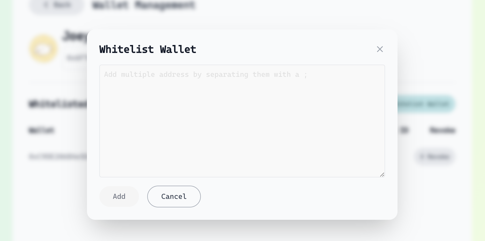
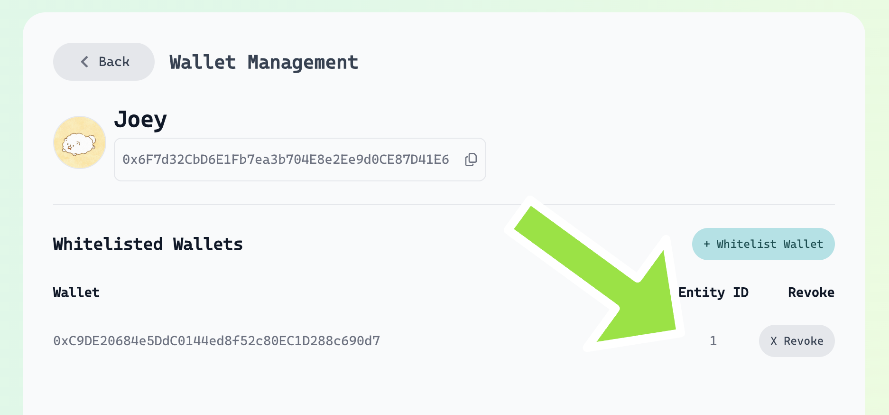

# ACP Node SDK Examples (without framework)

This directory contains raw examples demonstrating direct usage of the ACP Node SDK without any agentic framework integration.

## Directory Structure

- [`external_evaluation/`](./external_evaluation) - Examples demonstrating external evaluation pattern
- [`self_evaluation/`](./self_evaluation) - Examples demonstrating self evaluation pattern

## Environment Setup

Before running the examples, you need to set up your environment variables. Create a `.env` file in the example directory with the following variables:

```bash
# Required for all examples
WHITELISTED_WALLET_PRIVATE_KEY=0x...  # Your whitelisted wallet private key
WHITELISTED_WALLET_ENTITY_ID=...      # Your session entity key ID
BUYER_AGENT_WALLET_ADDRESS=0x...            # Buyer's wallet address
SELLER_AGENT_WALLET_ADDRESS=0x...           # Seller's wallet address

# Required for external evaluation examples
EVALUATOR_AGENT_WALLET_ADDRESS=0x...        # Evaluator's wallet address
```

### Getting the Required Values

1. **Whitelist Your Wallet**
   - Go to [Service Registry](https://acp-staging.virtuals.io/)
   - Navigate to the Agent Wallet page
   
   - Whitelist your wallet:
   
   

2. **Get Session Entity Key ID**
   - Find your session entity key ID in the Service Registry:
   

3. **Wallet Addresses**
   - `BUYER_AGENT_WALLET_ADDRESS`: The wallet address of the agent initiating the job
   - `SELLER_AGENT_WALLET_ADDRESS`: The wallet address of the agent providing the service
   - `EVALUATOR_AGENT_WALLET_ADDRESS`: (For external evaluation) The wallet address of the third-party evaluator

> **Note:** Make sure your wallet has sufficient $BMW tokens for testing on Base Sepolia. If you need tokens, please reach out to Virtuals' DevRel team.

## Evaluation Patterns

### Self Evaluation

Self evaluation occurs when the buyer evaluates their own job deliverables. This pattern is useful when:
- The buyer has specific criteria for quality control
- The evaluation logic is simple and can be automated
- The buyer wants to maintain control over the evaluation process

Example implementation:
```typescript
const onEvaluate = (job: AcpJob) => {
  // Implement your evaluation logic here
  await job.evaluate(true, "Self-evaluated and approved");
};
```

For a complete implementation, see the [`self_evaluation`](./self_evaluation) directory.

### External Evaluation

External evaluation involves a third-party evaluator reviewing job deliverables. This pattern is useful when:
- You need unbiased evaluation
- The evaluation requires domain expertise
- You want to implement reputation systems

Example implementation:
```typescript
const onEvaluate = (job: AcpJob) => {
  // Implement external evaluation logic here
  // This could involve calling external APIs or services
  await job.evaluate(true, "Externally evaluated and approved");
};
```

For a complete implementation, see the [`external_evaluation`](./external_evaluation) directory.

## Usage

To use these examples:

1. Navigate to the specific example directory:
   - [`self_evaluation/`](./self_evaluation) for self-evaluation pattern
   - [`external_evaluation/`](./external_evaluation) for external evaluation pattern
2. Review the implementation details
3. Copy the relevant code patterns to your implementation
4. Customize the evaluation logic according to your needs

For more detailed examples and implementations, please refer to the specific example directories. 